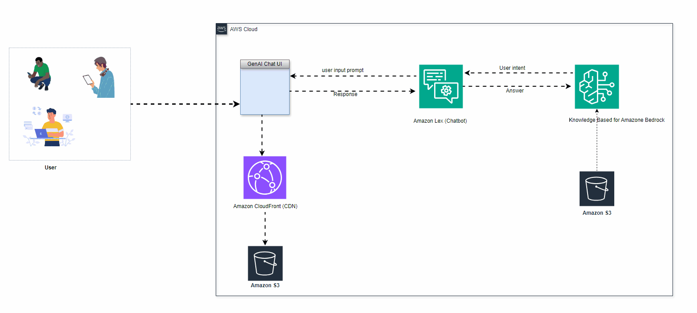

# Building-ai-digital-assistant
Building self-service digital assistant using amazon Bedrock, amazon Lex , CloudFront and amazon S3 bucket.

## 1. Introduction

## 2.  Requirements

Before Starting this guide, you will need:

- An AWS account (if you don't yet have one, please create one and [set up your environment](https://aws.amazon.com/getting-started/guides/setup-environment/))
- An IAM user that has the access and create AWS resources.
- Require access enabled for the Amazon Titan Embeddings G1 – Text model and Anthropic Claude 3 Haiku on Amazon Bedrock.

## 3. Architecture

 

 

To be continued ....